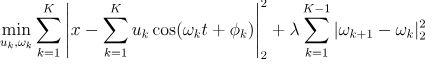
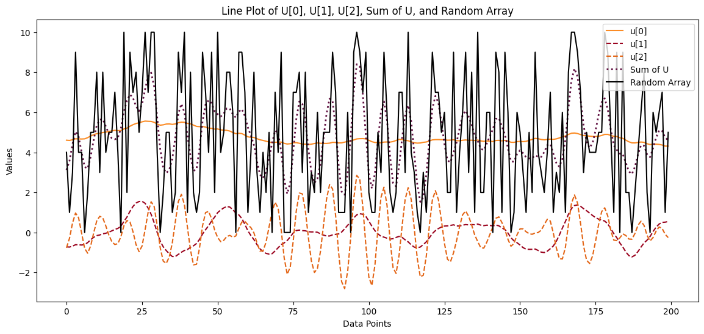

# Energy Load Forecasting 

## Overview

This project focuses on forecasting the Energy Load in Brazil using a combination of Variational Mode Decomposition (VMD) for time series decomposition and Bidirectional Long Short-Term Memory (Bi-LSTM) neural networks for forecasting. The goal is to provide accurate predictions of energy consumption for better resource planning.

## Requirements

- Python 3.9
- TensorFlow
- Keras
- Matplotlib
- Seaborn
- Pandas
- Numpy
- VMDpy

## Installation

1. Clone the repository:

    ```bash
    git clone https://github.com/VRMattos96/load-forecast.git
    ```

2. Navigate to the project directory:

    ```bash
    cd energy-load-forecasting
    ```

3. Install the required dependencies:

    ```bash
    pip install -r requirements.txt
    ```

## Project Structure

The project is organized as following:
```
load-forecasting/
│
├── 01.data/ # Dataset 
│ ├── raw/ # Raw data files
│ ├── processed/ # Processed data files
├── 02.codes/ # Source code
│ ├── data_processing/ # Code for data preprocessing
│ ├── modelling/ # Implementation of the forecasting model
│ ├── validation/ # Code for model validation
├── 03.results/ # Directory for storing results
├── README.md # Project README file
└── requirements.txt # List of Python dependencies
```
## Data Sources

The dataset used in this project was obtained from two trusted and authoritative sources: the Operador Nacional do Sistema (ONS) and the Instituto Nacional de Meteorologia (INMET), both government institutions in Brazil.

### 1. ONS - Operador Nacional do Sistema

The ONS, or National System Operator, is a key institution responsible for the coordination and operation of the Brazilian power system. The energy load data used in this project was sourced from the ONS platform.

- **Data Source:** [ONS Data Portal](https://dados.ons.org.br/dataset/carga-energia-verificada)

The provided link directs to the ONS Data Portal's dataset containing verified energy load information. The ONS ensures the reliability and accuracy of this data, making it a valuable resource for energy-related analyses and forecasting.

### 2. INMET - Instituto Nacional de Meteorologia

The INMET, or National Institute of Meteorology, is another reputable government institution in Brazil. Meteorological data obtained from INMET complements the energy load dataset, providing additional contextual information that influence energy consumption.

- **Data Source:** [INMET Data Portal](https://bdmep.inmet.gov.br/)

The provided link leads to the INMET Data Portal, where meteorological data can be accessed. This data includes weather conditions, temperature, and other meteorological factors that play a crucial role in understanding energy consumption patterns.

### Data Combination and Preprocessing

To create a comprehensive dataset for energy load forecasting, the ONS energy load data and the meteorological data from INMET were combined and underwent preprocessing steps. This integration enhances the accuracy of the forecasting model by considering both energy-related and meteorological factors.

## Feature Engineering: Variational Mode Decomposition (VMD)

In this project, one of the key feature engineering techniques employed is Variational Mode Decomposition (VMD). VMD is a data-driven approach used for time series decomposition, which aims to decompose a time series signal into a set of oscillatory modes.

### What is Variational Mode Decomposition?

Variational Mode Decomposition is a signal processing technique that decomposes a given time series signal into a set of modes, each representing a different oscillatory pattern within the signal. The decomposition is achieved through an optimization process that minimizes a defined cost function, leading to the extraction of intrinsic mode functions (IMFs).

### How VMD is Applied in this Project

1. **Decomposition of Time Series:**
   - The original time series, representing energy load data, is decomposed into its constituent oscillatory modes using VMD.

2. **Identification of Patterns:**
   - Each mode extracted by VMD corresponds to a specific oscillatory pattern within the time series. These patterns can represent various underlying factors affecting energy load, such as seasonality, trends, and anomalies.

3. **Feature Extraction:**
   - The extracted modes serve as features for the subsequent steps in the modeling process. These features aim to capture the relevant information within the energy load data, providing a basis for more accurate forecasting.

## VMD Equations

#### Objective Function:

The VMD optimization problem is formulated as follows:



Where:
- \( x(t) \) is the original time series.
- \( u_k \) and \( \omega_k \) are the amplitude and frequency of the \( k \)-th mode, respectively.
- \( \phi_k \) is the phase of the \( k \)-th mode.
- \( \lambda \) is a regularization parameter.
- \( K \) is the number of modes.

### Summation to Reconstruct Original Signal

It's important to note that the sum of all decomposed nodes, or intrinsic mode functions (IMFs), obtained through VMD reconstruction, reproduces the original signal. This property ensures that the information contained in the decomposed modes is exhaustive and can be combined to recreate the original energy load signal.


#### Demonstration:



### Why VMD?

- VMD is particularly useful in scenarios where a time series exhibits complex and non-linear patterns.
- It allows for the separation of different frequency components, making it suitable for capturing various temporal aspects of energy load data.

By employing VMD as part of the feature engineering process, we aim to enhance the effectiveness of our forecasting model by capturing and utilizing the inherent patterns present in the energy load time series data.


## References

### Papers

1. Shahzad Muzaffar, Afshin Afshari. (2019). "Short-term load forecasts using LSTM networks." *Energy Procedia*, 158, 2922-2927. [DOI](https://doi.org/10.1016/j.egypro.2019.01.540)

2. Xiao Zhou, Chengxi Liu, Yongjian Luo, Baoying Wu, Nan Dong, Tianying Xiao, Haojun Zhu. (2022). "Wind power forecast based on variational mode decomposition and long short term memory attention network." *Energy Reports*, 8, 922-931. [DOI](https://doi.org/10.1016/j.egyr.2022.08.159)

3. M. Peixeiro. (2022). "Time Series Forecasting in Python." [Manning](https://books.google.com.br/books?id=hqXczgEACAAJ). ISBN: 9781617299889.

### Additional Resource

- Introduction to Variational Mode Decomposition (VMD) by Vamsi Varma. [Medium Article](https://vamsivk1995.medium.com/introduction-to-variational-mode-decomposition-vmd-d7100210a56a)
